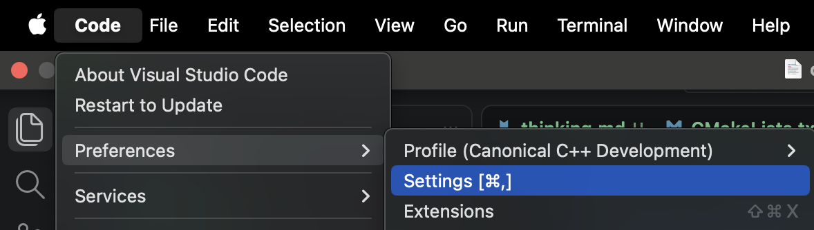
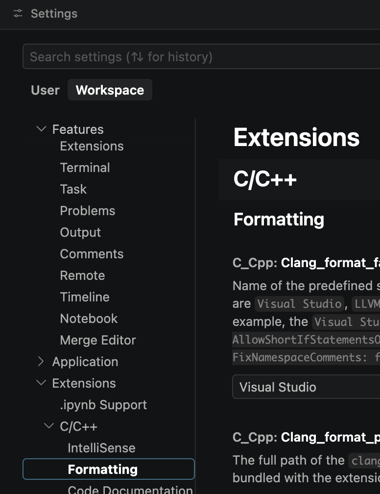
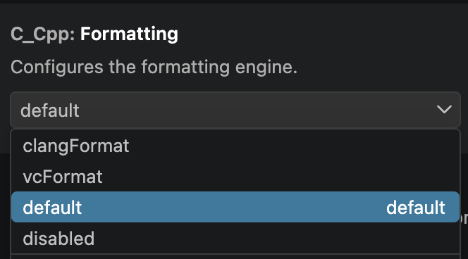

# Consider how VSCode applies settings to stuff?

VSCode drives me crazy with its opaque and obscure 'settings' behaviour?

## 20260821

I created this Github repo and injected initial stuff for VSCode develpment and cmake build.

And again I faced the propblem of configuring VSCode to be able to format my cpp-code.

* It seems the first key understanding is that there are 'user settings' and 'woprkspace settings'?
* It seems 'workspace settings' are defined by a file '.vscode/settings.json'
  * The first obstacle is to get to edit the file.
  * The folder '.vscode' is invisible (on macOS at least)
  * One way is to use VSCode GUI ``` <Code>/<Preferences>/<Settings> ```

  

  * BEWARE: There are 'User' and 'Workspace' settings.
    * According to coPilot:
    * Workspace settings: ``` <project>/.vscode/settings.json ```
    * User settings on macOS: ``` ~/Library/Application Support/Code/User/settings.json ```
    * See "My User VSCode User Settings' below.
  * It is still unclear to me how Usre and Workspace settings interact or override eachother?
  * For sharing settings I suppose 'Workspace' is the way to go?
  
* I start to udnerstand why my C++ foamtting always eems broken for me!

  * I found Settings/Workspace/Exstensions/'C/C++'/Format

    

  * Code/Preferences/Settings/Workspace/Exstensions/'C/C++'/Format/'C_Cpp: Clang_format_fallback Style'

```text

C_Cpp: Clang_format_fallback Style
Name of the predefined style used as a fallback in case clang-format is invoked with style file but the .clang-format file is not found. Possible values are Visual Studio, LLVM, Google, Chromium, Mozilla, WebKit, Microsoft, GNU, none, or use {key: value, ...} to set specific parameters. For example, the Visual Studio style is similar to: { BasedOnStyle: LLVM, UseTab: Never, IndentWidth: 4, TabWidth: 4, BreakBeforeBraces: Allman, AllowShortIfStatementsOnASingleLine: false, IndentCaseLabels: false, ColumnLimit: 0, AccessModifierOffset: -4, NamespaceIndentation: All, FixNamespaceComments: false }.  

```
  * Code/Preferences/Settings/Workspace/Exstensions/'C/C++'/Format/'C_Cpp: Formatting'

      


  * 'C_Cpp Vc Format New Line Before Open Brace: Block' = same line

    * BEWARE: There is a setting for each type of 'brace'
    *         Function, lambda, namespace, type...
    * *SIGH*

  * I ended up with the following Workspace settings '.vscode/settings.json'

```json
{
  "files.autoSave": "afterDelay",
  "editor.defaultFormatter": null,
  "C_Cpp.clang_format_style": "Visual Studio",
  "C_Cpp.formatting": "vcFormat",
  "C_Cpp.vcFormat.newLine.beforeOpenBrace.block": "sameLine",
  "C_Cpp.clang_format_fallbackStyle": "none",
  "C_Cpp.vcFormat.newLine.beforeOpenBrace.function": "sameLine",
  "C_Cpp.vcFormat.newLine.beforeOpenBrace.lambda": "sameLine",
  "C_Cpp.vcFormat.newLine.beforeOpenBrace.namespace": "sameLine",
  "C_Cpp.vcFormat.newLine.beforeOpenBrace.type": "sameLine",
  "C_Cpp.vcFormat.newLine.closeBraceSameLine.emptyFunction": true,
  "C_Cpp.vcFormat.newLine.closeBraceSameLine.emptyType": true,
  "files.autoSaveDelay": 3000,
  "editor.tabSize": 2,
  "editor.detectIndentation": false
}
```

* It seems (maybe?) that workspace settings override User settings?

  * At least for tab size I had tab size 8 in workspace and 2 in User
  * ANd the editor applied 8.
  * DROVE ME CRAZY to find out!!!

* And inside it we have to navigate boith the JSON structure and VSCode settings semantics?!


Final thought!

* VSCOde is just IN THE WAY!!
* Do I need to switch to some down-to-earth editor?
* Maybe join the cool kids and learn vim?
* Or go back to Emacs (but I have not used it since the 80's)?
* I used Borland amd Embarcadero for a long time (so I know their key-bindings still)?

### My VSCode User Settings (20260821)

I found my own 'user settings'

  * It seems to be a lot of stuff I would like to edit and/or remove?

```json
kjell-olovhogdahl@MacBook-Pro ~/Documents/GitHub/cpp_habilis % cat ~/Library/Application\ Support/Code/User/settings.json
{
    "workbench.colorTheme": "Visual Studio Dark - C++",
    "python.pythonPath": "/usr/local/bin/python3",
    "php.validate.executablePath": "/usr/bin/php",
    "php.suggest.basic": false,
    "php.validate.enable": false,
    "cmake.showOptionsMovedNotification": false,
    "git.untrackedChanges": "hidden",
    "diffEditor.ignoreTrimWhitespace": false,
    "cmake.pinnedCommands": [
        "workbench.action.tasks.configureTaskRunner",
        "workbench.action.tasks.runTask"
    ],
    "[cpp]": {
        "editor.defaultFormatter": "xaver.clang-format"
    },
    "[xml]": {},
    "editor.autoIndent": "keep",
    "editor.detectIndentation": false,
    "editor.guides.highlightActiveIndentation": false,
    "C_Cpp.vcFormat.indent.caseContents": false,
    "C_Cpp.vcFormat.indent.gotoLabels": "none",
    "C_Cpp.vcFormat.indent.lambdaBracesWhenParameter": false,
    "C_Cpp.vcFormat.indent.namespaceContents": false,
    "C_Cpp.vcFormat.indent.preprocessor": "none",
    "C_Cpp.vcFormat.indent.multiLineRelativeTo": "statementBegin",
    "files.autoSave": "afterDelay",
    "editor.tabSize": 2,
    "git.openRepositoryInParentFolders": "never",
    "zensep.executablePath": "",
    "breadcrumbs.enabled": false,
    "editor.defaultFormatter": "itfied.zensep",
    "workbench.editorAssociations": {
      "*.xls": "default"
    },
    "claudeCode.preferredLocation": "panel",
    "python.createEnvironment.trigger": "off",
    "zenMode.hideLineNumbers": false,
    "chat.disableAIFeatures": true,
    "cpp-devtools.enableCppCodeEditingTools": false,
    "cpp-devtools.enableCMakeGetDiagnosticsTool": false
}%                                                                                                                                                                                                                    kjell-olovhogdahl@MacBook-Pro ~/Documents/GitHub/cpp_habilis % 
```